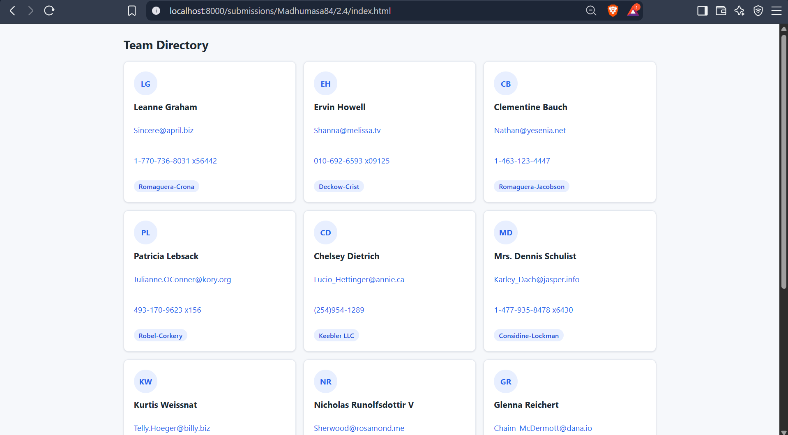
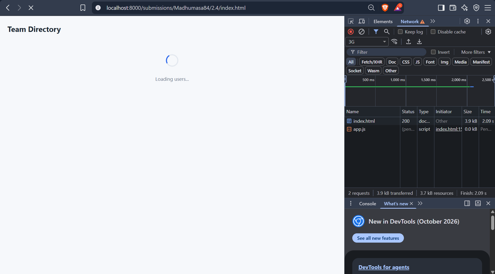
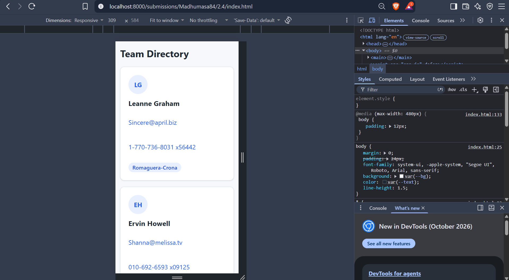

# Exercise 2.4: Fetch and Display API Data

A Team Directory page that fetches users from the JSONPlaceholder API
(`https://jsonplaceholder.typicode.com/users`) and shows them in a card grid.

Files: `index.html`, `app.js`

## Demo

### Success (desktop)

### Loading (spinner)

### Mobile (375 px)

### Error state (screen recording)

Recorded with DevTools Network set to Offline, showing the error message and the Retry button.

[Watch the error state recording](screenshots/2.4_error.mp4)
